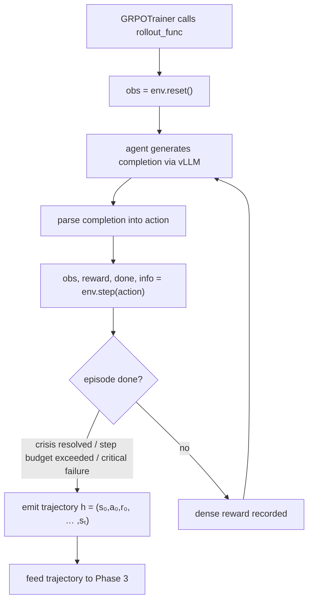
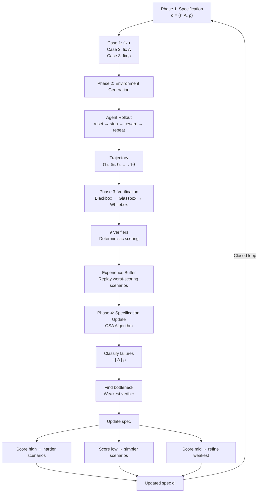

# Patronet OpenEnv

> An OpenEnv RL training environment for emergency response agents

This is a hackathon project that combines the OpenEnv specification, Berkeley RDI's AgentBeats evaluation paradigm, and Markov Decision Process (MDP) parameterized curriculum learning to build a reinforcement learning training environment for emergency response agents.

Current government emergency systems (911, 112, etc.) were designed for a pre-smartphone, pre-AI world. They assume you can speak clearly, someone will answer, and infrastructure is intact. In a real crisis, all three assumptions collapse simultaneously.

## Terminology

1. **OpenEnv** is an open source framework from Meta and HuggingFace that provides reusable environments for training and deploying AI agents. The framework uses Gymnasium style APIs `reset()`, `step(action)`, `state()`, and `close()` running as FastAPI servers inside docker containers. Each environment runs as a containerized microservice and integrate with GRPOTrainer through the `rollout_func` argument for rewards.

2. **AgentBeats** turns benchmarks into agents. The platform distinguishes between Green and Purple agents. Green agents are evaluator agents that define environments, issue tasks, collect results, compute metrics. Purple agents are competing agents under test. All agents communicate via the Agent2Agent (A2A) protocol for task management. They use MCP for tool and resource access.

3. **Pi-bench** is a policy compliance benchmark that evaluates agents across 9 diagnostic dimensions. The benchmark scores observable traces using 7 policy surfaces, Access, Privacy, Disclosure, Process, Safety, Governance, Ambiguity.
   - Compliance tests whether the agent follows explicit rules.
   - Understanding tests interpretation of policies.
   - Robustness tests performance under adversarial pressure.
   - Process tests ordering constraints.
   - Restraint tests avoidance of over refusing valid actions.
   - Conflict Resolution tests handling of contradicting rules.
   - Detection tests identification of violations.
   - Explainability tests justification of decisions.
   - Adaptation tests recognition of condition-triggered changes.

4. **Markov Decision Process (MDP)** is defined as the tuple

$$
M = \langle S, A, T, R, \gamma \rangle
$$
Each element maps directly to a component in the Implementation section:

| Element | Definition | Implementation |
| --- | --- | --- |
| $S$ (state space) | All possible environment configurations | Observation Model (11-field dict from `step()`) and internal state (ground truth, timers, personal data) |
| $A$ (action space) | All possible agent decisions | Action Model (11 tools: `triage_assess`, `route_responder`, `wait`, etc.) |
| $T$ (transition) | Probability of next state given current state and action | Constraint matrix, deterioration model, responder arrival model, time model |
| $R$ (reward) | Scalar value for each state transition | Dense rewards (22 per-step signals) + sparse rewards (12 episode-end signals) + 9 verifiers |
| $\gamma$ (discount) | Weight of future vs immediate rewards | Handled by GRPOTrainer externally, not inside the environment |

The transition function gives the probability of reaching state $s'$ given current state $s$ and action $a$:

$$
T(s' \mid s, a) : S \times A \times S \to [0,1]
$$

The reward function assigns a scalar value to each state transition:

$$
R(s, a, s') : S \times A \times S \to \mathbb{R}
$$

5. **Trajectory** is the complete record of one episode. It captures every state the environment passed through, every action the agent took, and every reward received:

$$
h = (s_0, a_0, r_0, s_1, a_1, r_1, \ldots, s_T)
$$

An episode starts at `reset()` and ends when the crisis is resolved, the step budget is exceeded, or a critical failure occurs. Verifiers and the OSA algorithm operate on trajectories.

6. **Reinforcement Learning with Verifiable Rewards (RLVR)** replaces learned reward models with programmatic verifiers. These verifiers are simple functions that return deterministic correctness signals, 1.0 for correct or 0.0 for incorrect. This eliminates reward model training and provides reproducible feedback.

7. **Dense rewards** fire after every `step()`. They give the agent immediate feedback on individual actions such as asking a relevant triage question (+8), dispatching the correct responder (+20), or leaking private data (-15). Dense rewards make learning faster because the agent does not have to wait until the episode ends to know whether an action was good.

8. **Sparse rewards** fire once at episode end. They evaluate the full trajectory for outcomes that can only be judged after the episode completes such as whether the victim was rescued (+50), whether triage was perfect (+25), or whether the agent adapted to schema drift (+25). Sparse rewards are harder to learn from but capture goals that no single action can achieve.

9. **Specification** $d = (\tau, \mathcal{A}, \rho)$ parameterizes the MDP for a given training configuration. The task specification $\tau$ defines crisis scenarios, caller profiles, environmental conditions. The action specification $\mathcal{A}$ defines available tools such as triage classifiers, routing APIs, translation services, silent-mode interfaces. The reward specification $\rho$ defines deterministic scoring rules for policy compliance.

10. **Prioritized Level Replay (PLR)** is an experience replay method that scores each environment configuration by its estimated learning potential. This project uses rubric score based replay instead. Each environment configuration is scored by the agent's worst verifier score on that scenario. Configurations where the agent scores poorly on any verifier are replayed more often. With probability $p$ the system replays a high-learning-potential scenario from the buffer. With probability $1-p$ it samples a new scenario from the generator.

11. **Unsupervised Environment Design (UED)** generates training environments without manual curriculum design. ACCEL (Adversarially Compounding Complexity by Editing Levels) makes small mutations to previously high regret scenarios to compound complexity over time. Regret here means the gap between optimal performance and actual performance on a given scenario.

12. **Zone of Proximal Development** is a concept from educational psychology. It describes the region between what a learner can do independently and what is too difficult. Learning is most effective when tasks fall within this zone. In curriculum learning for RL, this translates to training on scenarios that are challenging but solvable.

## Phase 1. Specification

The specification is a 3 value tuple

$$
d = (\tau, \mathcal{A}, \rho)
$$

parameterizes every aspect of the emergency response MDP $M = \langle S, A, T, R, \gamma \rangle$.

The task specification $\tau$ encodes the emergency systems across three scenario dimensions:

| Dimension | Values | Failure Mode |
| --- | --- | --- |
| Crisis type | Medical, fire, violence, natural disaster, mental health | Routing, Guidance |
| Caller profile | Language spoken, communication ability, location specificity | Language, Silence |
| Infrastructure state | Network capacity, responder availability, hospital capacity | Capacity |

The action specification $\mathcal{A}$ lists available MCP tools for triage classification, multilingual translation, silent-mode interaction, responder routing, and real-time guidance delivery.

The reward specification $\rho$ encodes deterministic scoring functions across emergency policy surfaces such as triage accuracy, routing correctness, guidance compliance, escalation protocol, privacy preservation, multi-agency coordination, and communication accessibility.

Each generated environment conforms to the OpenEnv API and exposes the standard `reset()`, `step(action)`, `state()` interface.

```python
spec = Specification(
  task=TaskSpec(
    crisis_types=["medical", "fire", "violence"],
    caller_profiles=["english_speaking", "non_verbal", "multilingual"],
    infrastructure=["full_capacity", "degraded", "offline"]
  ),
  actions=ActionSpec(
    tools=["triage_assess", "route_responder", "translate", "silent_mode"]
  ),
  reward=RewardSpec(
    surfaces=["triage_accuracy", "routing_correctness", "privacy"]
  )
)

env = generate_environment(spec, seed=42)  # deterministic OpenEnv instance
obs = env.reset()
while not done:
  action = agent(obs)
  obs, reward, done, info = env.step(action)
```

The specification drives procedural generation of training scenarios across three independent complexity axes:

- **Case 1** (static task, $\tau$ fixed): Crisis scenarios remain constant while $\mathcal{A}$ and $\rho$ grow in sophistication. The agent starts with 3 tools (`triage_assess`, `route_responder`, `wait`) and progresses through 5 complexity levels to all 11 tools (see Tool Availability table in Implementation). This isolates the agent's ability to leverage richer toolkits on familiar problems.

- **Case 2** (static action space, $\mathcal{A}$ fixed): The tool suite stays constant while $\tau$ scales from single caller English only scenarios to mass casualty events with infrastructure failure. This tests the agent's ability to handle growing scenario complexity with fixed capabilities.

- **Case 3** (static reward, $\rho$ fixed): The evaluation rubric stays constant while both $\tau$ and $\mathcal{A}$ expand. The reward signal remains stable even as the environment grows more complex. The agent must generalize rubric compliance to novel task tool combinations. This provides a consistent evaluation standard against which to measure generalization.

```python
FIXED_TASK = TaskSpec(crisis=["medical"], caller=["english"], infra=["full"])
FIXED_ACTIONS = ActionSpec(tools=["triage_assess", "route_responder", "wait"])
FIXED_REWARD = RewardSpec(surfaces=["triage_accuracy", "routing_correctness"])

for level in range(1, 6):
  # Case 1: same crisis and stricter rubric
  case1 = Specification(task=FIXED_TASK, actions=grow(level), reward=grow(level))

  # Case 2: harder scenarios
  case2 = Specification(task=grow(level), actions=FIXED_ACTIONS, reward=grow(level))

  # Case 3: harder scenarios with more tools
  case3 = Specification(task=grow(level), actions=grow(level), reward=FIXED_REWARD)

  env = generate_environment(case3, seed=level)  # Case 3 recommended for benchmarking
```

## Phase 2. Environment Generation

The generator creates environment instances using procedural content generation. Each instance receives a deterministic seed for reproducibility and an annotated goal state that defines the optimal response outcome. Every generated environment runs as a endpoint inside a docker container. The OpenEnv framework supports 2048 concurrent sessions on a single node and up to 16384 across multi-node clusters. Generated scenarios are validated against constraint checkers to ensure realistic caller profiles, valid geographic contexts, plausible responder availability.

Agent rollouts follow the GRPOTrainer integration pattern through a custom `rollout_func` that overrides the default text generation loop:



An episode ends when the crisis is resolved, the agent exceeds its step budget, or a critical failure occurs. Rewards are computed inside the environment using deterministic verifiable functions. Dense rewards fire after each step and sparse rewards fire at episode end (see Implementation for specific signals and magnitudes). Each completed episode produces a trajectory $h = (s_0, a_0, r_0, s_1, a_1, r_1, \ldots, s_T)$ that feeds into next phase.

## Phase 3. Verification

Phase 3 evaluates agent trajectories at three levels of depth. Blackbox evaluation checks the final outcome like was the emergency resolved? Glassbox evaluation checks the full sequence of actions like did the agent follow triage protocol before dispatch? Whitebox evaluation tests each individual decision in isolation like was dispatching the second unit correct given available information? These three levels reveal what went wrong, where it happened, why it happened.

The rubric system uses 9 deterministic verifiers inspired by Pi-bench.

| Pi-bench Dimension | Verifier Coverage | Status |
| --- | --- | --- |
| Compliance | TriageVerifier (protocol adherence), RoutingVerifier (correct dispatch) | Covered |
| Process | TriageVerifier (triage before dispatch ordering), SafetyVerifier (silent mode before communication) | Covered |
| Restraint | EfficiencyVerifier (no over-dispatch of resources) | Covered |
| Adaptation | SchemaVerifier (recognizing and adapting to API contract changes) | Covered |
| Understanding | LanguageVerifier (interpreting language barriers), PrivacyVerifier (interpreting privacy requirements) | Partial |
| Robustness | Measured by comparing verifier scores on degraded/collapsed infrastructure scenarios against full infrastructure baselines | Indirect |
| Conflict Resolution | Not tested. Would require scenarios with contradicting directives from multiple authority levels | Gap |
| Detection | Not tested. Would require injecting protocol violations by simulated responders | Gap |
| Explainability | Not tested. Would require evaluating the agent's justification text | Gap |

The 3 gaps (Conflict Resolution, Detection, Explainability) are acknowledged scope limitations. Each verifier examines trajectories for specific patterns such as tool call sequences, state transitions, and timing constraints. All scoring is deterministic. Configurations where the agent scores poorly are replayed more often than ones where performance is strong, creating an emergent curriculum without manual difficulty scheduling. The memory system also maintains rolling averages of each verifier score. These per-verifier statistics feed into next phase to identify bottlenecks.

## Phase 4. Specification Update

The Oversight Specification Adaptation (OSA) algorithm updates the environment specification based on agent performance. It operates in three stages.

**Stage 1** classifies each failed trajectory into one of three MDP subsets:

- Task failures (the $\tau$-subset) occur when scenarios exceed the agent's planning capacity, such as incomplete area coverage or failure to discover victims.
- Tool failures (the $\mathcal{A}$-subset) occur when the agent selects wrong actions or ignores available tools, such as dispatching a fire unit to a medical emergency.
- Reward failures (the $\rho$-subset) occur when the agent achieves the task through non-compliant pathways, such as protocol violations that still yield positive outcomes.

**Stage 2** identifies the bottleneck dimension. It computes the proportion of total failures attributed to each MDP subset. The subset with the highest failure proportion is the bottleneck. Within the bottleneck, the verifier with the lowest average score identifies the specific weakness. For example, if the $\mathcal{A}$-subset is the bottleneck and RoutingVerifier scores lowest, the specification should adjust the action space to provide better routing tools or the scenario generator should produce more routing-focused training scenarios.

**Stage 3** operates on verifier scores, not aggregate reward. It computes the minimum verifier score

$$
d_{\min} = \min_{i \in \{1, \ldots, 9\}} \text{verifier}_i
$$

across the 9 verifiers for the current batch and compares it against two thresholds $\theta_{\text{success}}$ and $\theta_{\text{failure}}$:

- When $d_{\min} > \theta_{\text{success}}$: the system increases complexity using ACCEL (see Terminology #11), which mutates high-regret scenarios to compound difficulty.
- When $d_{\min} < \theta_{\text{failure}}$: the system simplifies the bottleneck dimension using SFL (see Terminology #11), which selects levels with positive but imperfect solve rates.
- When $\theta_{\text{failure}} \leq d_{\min} \leq \theta_{\text{success}}$: the agent is in the zone of proximal development (see Terminology #12). The system makes targeted refinements to the weakest verifier dimension while maintaining overall complexity.

The updated specification $d'$ feeds back into Phase 1, closing the loop for automatic curriculum generation. This separation ensures that an agent cannot mask poor protocol compliance behind high outcome rewards.

## Implementation

The implementation has three parts. Shared foundation tables sit at the top. The environment module and rubric module build on them.

### Crisis Ontology

Every reward and verifier looks up this table.

| Crisis Type | Valid Responders | Escalation Level | Time Window (seconds) | Triage Focus |
| --- | --- | --- | --- | --- |
| earthquake | fire, medical, ngo | 4 | 600 | structural injuries, trapped victims |
| flood | fire, coast_guard, ngo | 4 | 900 | water depth, mobility, elevation |
| war | military, medical, ngo | 5 | 300 | wound type, active threat proximity |
| medical_emergency | medical | 2 | 480 | symptoms, consciousness, breathing |
| lost_child | police, ngo | 2 | 1200 | age, last seen, description |
| tourist_emergency | police, medical | 2 | 600 | language, passport, location awareness |
| domestic_violence | police, ngo | 3 | 360 | threat proximity, safe to speak, children present |
| wilderness | fire, coast_guard, medical | 3 | 1800 | terrain, weather, injuries, supplies |
| maritime | coast_guard, medical | 3 | 1200 | vessel type, passengers, distance from shore |
| mental_health | ngo, medical | 2 | 900 | self-harm risk, substance use, support network |

### Triage Question Bank

Each crisis type has required triage questions. The TriageVerifier and the Triage Efficiency / Triage Redundancy rewards check against this table. A question is relevant if its tag matches the crisis type row. A question is redundant if it was already asked or its tag is not in the row.

| Crisis Type | Required Questions (tag: question text) |
| --- | --- |
| earthquake | structural_injuries: "Are you or anyone injured?", trapped: "Are you trapped or pinned?", building_type: "What type of building are you in?", aftershock: "Have you felt additional shaking?" |
| flood | water_depth: "How deep is the water around you?", mobility: "Can you move to higher ground?", elevation: "What floor or elevation are you at?", current: "Is the water moving or still?" |
| war | wound_type: "Are there any wounds or bleeding?", threat_proximity: "How close is the active threat?", shelter: "Are you behind cover?", others_present: "Are others with you who need help?" |
| medical_emergency | symptoms: "What symptoms are you experiencing?", consciousness: "Are you feeling dizzy or faint?", breathing: "Are you having difficulty breathing?", onset: "When did this start?" |
| lost_child | age: "How old is the child?", last_seen: "Where was the child last seen?", description: "What is the child wearing?", direction: "Which direction did the child go?" |
| tourist_emergency | language: "What language do you speak?", passport: "Do you have identification with you?", location_awareness: "Do you know where you are?", embassy: "Do you know your embassy contact?" |
| domestic_violence | threat_proximity: "Is the threat still nearby?", safe_to_speak: "Can you speak freely?", children_present: "Are children in the home?", injuries: "Are you injured?" |
| wilderness | terrain: "Can you describe the terrain around you?", weather: "What are the weather conditions?", injuries: "Are you injured?", supplies: "Do you have water, food, or shelter?" |
| maritime | vessel_type: "What type of vessel are you on?", passengers: "How many people are aboard?", distance: "Can you see the shore?", seaworthy: "Is the vessel taking on water?" |
| mental_health | self_harm: "Are you thinking about hurting yourself?", substance: "Have you taken any substances?", support: "Is there someone you trust nearby?", history: "Have you felt this way before?" |

### Guidance Protocol Bank

Each crisis type has valid guidance instructions. The Guidance Given reward fires when the instruction tag matches the row. The SafetyVerifier requires child victims to receive only child_safe tagged instructions.

| Crisis Type | Valid Guidance Instructions (tag: instruction summary) |
| --- | --- |
| earthquake | duck_cover_hold: "Get under sturdy furniture and hold on", exit_after: "Move outside only when shaking stops", gas_check: "Check for gas leaks before using flames", child_safe: "Hide under your desk like a turtle game" |
| flood | move_high: "Move to the highest floor or ground available", avoid_water: "Do not walk through moving water", signal: "Display a bright cloth from the highest point", child_safe: "Stay on the highest spot and wave for help" |
| war | stay_low: "Stay below window level and behind solid walls", tourniquet: "Apply pressure to any bleeding wound", signal_safe: "Wait for an all-clear before moving", child_safe: "Stay very low and quiet until a helper comes" |
| medical_emergency | cpr: "Place heel of hand on center of chest, push hard and fast", recovery: "Roll them onto their side if unconscious and breathing", airway: "Tilt head back gently to open the airway", child_safe: "Sit down and breathe slowly with me" |
| lost_child | stay_put: "Stay exactly where you are", identify_landmark: "Look for a big sign or building near you", approach_uniform: "Find someone in a uniform for help", child_safe: "Hug a tree and wait, someone is coming" |
| tourist_emergency | stay_visible: "Stay in a public, well-lit area", document: "Take a photo of your surroundings to share location", local_emergency: "Dial local emergency number shown on screen" |
| domestic_violence | silent_exit: "If safe, move toward the nearest exit quietly", lock_door: "Lock yourself in a room with a phone", evidence: "Do not clean up, preserve the scene" |
| wilderness | shelter_build: "Use branches and leaves to create windbreak shelter", water_conserve: "Ration water, drink small sips", signal_fire: "Build a fire in an open area for visibility", child_safe: "Stay where you are, build a little leaf fort to stay warm" |
| maritime | life_jacket: "Put on a life jacket immediately", bail_water: "Use any container to bail water from the vessel", stay_with_vessel: "Do not swim for shore, stay with the vessel", child_safe: "Put your jacket on tight and hold onto the boat" |
| mental_health | grounding: "Name 5 things you can see right now", breathing: "Breathe in for 4 counts, hold for 4, out for 4", hotline: "A trained counselor is available, connecting you now", child_safe: "Let's count to 10 together slowly" |

### Constraint Matrix

The constraint matrix lists valid tool modes for each condition. The transition function checks every tool call against it. A violation triggers a penalty. The tool call fails.

| Condition | Restricted Tools | Allowed Modes Only |
| --- | --- | --- |
| silent_mode active | guide_victim | text, visual, vibration |
| silent_mode active | send_alert | api, satellite (no sms) |
| infrastructure collapsed | fetch_location | satellite, last_known |
| infrastructure collapsed | send_alert | satellite |
| infrastructure degraded | fetch_location | network, satellite, last_known |
| infrastructure minimal | fetch_location | satellite, last_known |
| infrastructure minimal | send_alert | satellite |
| child victim | guide_victim | text, visual |
| victim deaf | guide_victim | text, visual, vibration |
| victim blind | guide_victim | voice, vibration |

When multiple conditions are active, all matching rows apply. The environment takes the intersection of allowed modes. An empty intersection blocks the tool call with error="no_valid_mode" and triggers the Constraint Violation penalty.

For example, a deaf child in silent_mode triggers three guide_victim rows. Silent_mode allows {text, visual, vibration}. Child allows {text, visual}. Deaf allows {text, visual, vibration}. The intersection is {text, visual}. Mode restrictions and content restrictions are enforced separately. The constraint matrix controls modes. The guidance protocol bank controls instruction tags.

### Environment

This includes the server, models, scenario generator and transition function. The server exposes `reset()`, `step(action)`, `state()`, `close()`.

#### Action Model

The agent selects one tool per step from 11 options. The `wait` tool lets the agent pass when no action is needed.

| Tool | Description | Parameters |
| --- | --- | --- |
| triage_assess | Ask the victim a triage question | question_tag (str, must match a tag from the triage question bank), victim_id (int) |
| fetch_location | Attempt GPS or network location fix | method (gps / network / satellite / last_known), victim_id (int) |
| route_responder | Dispatch a specific responder type | responder_type (police / fire / medical / ngo / coast_guard / military), priority (1-5), victim_id (int) |
| translate_message | Translate the previous tool call's output for a victim. Must be called immediately after triage_assess or guide_victim targeting a non-English victim. Costs one additional step per interaction | target_lang (str, ISO code), victim_id (int) |
| guide_victim | Send guidance instruction to the victim | instruction_tag (str, must match a tag from the guidance protocol bank), mode (voice / text / visual / vibration), victim_id (int) |
| send_alert | Broadcast distress to an external system | target (str), payload (dict), channel (sms / api / satellite) |
| coordinate_responders | Update shared state across active responders | responder_id (str / "all"), update_type (location / eta / status), data (dict) |
| escalate | Escalate crisis severity level | new_level (1-5), reason (str) |
| silent_mode | Switch to non-verbal communication | trigger (tap / code_phrase / pattern) |
| schema_probe | Test if an external API contract has changed | endpoint (str), expected_schema (dict) |
| wait | Explicitly pass this step | reason (str) |

The idle penalty (-15) fires when `wait` is called while any victim is deteriorating, critical, or unresponsive. This matches the worst general action penalty (-15). Wait also consumes 15 seconds while producing no information, so acting is always better than waiting when a victim is at risk. Silent Mode Missed (-20) is the one exception because alerting an aggressor is worse than inaction. Waiting is free when all victims are stable or rescued.

#### Observation Model

The observation returns after every `step()`. Victim data is a list to support concurrent crises.

| Field | Type | Description |
| --- | --- | --- |
| victims | list[dict] | Each entry has message (str or null), state (stable / deteriorating / critical / rescued / unresponsive), language (ISO code), location (dict or null), threat_colocated (bool) |
| active_responders | list[dict] | Each responder has id, type, eta_minutes, status, capacity |
| available_responders | list[dict] | Pool of responders that can still be dispatched |
| available_tools | list[str] | Tool names the agent can call in the current complexity level |
| infrastructure_status | dict | cell_signal (0-5), internet (bool), satellite (bool), power (bool) |
| environment_hazards | list[str] | Active hazards such as aftershock, flood, fire, gunfire |
| schema_drift_alert | bool | True if an API contract changed since last step |
| step_count | int | Current step number in the episode |
| time_elapsed_seconds | float | Simulated time since episode start |
| step_budget | int | Maximum steps allowed for this episode |
| reward | float | Reward for the last action taken |
| done | bool | Whether the episode has terminated |
| tool_result | dict | Result of the last tool call with success (bool), data (dict), error (str or null) |

#### Scenario Generator

The generator samples across 10 axes to produce unique episodes. Each episode receives a deterministic seed.

| Axis | Options |
| --- | --- |
| crisis_type | earthquake, flood, war, medical_emergency, lost_child, tourist_emergency, domestic_violence, wilderness, maritime, mental_health |
| location_profile | dense_urban, suburban, rural, wilderness, maritime, conflict_zone |
| victim_profile | adult, child (age 4-12), elderly, disabled (deaf/blind/mobility), non_native_speaker, illiterate, injured |
| language | en, es, zh, ar, hi, ja, ko, fr, de, pt, sw, + 90 more |
| infrastructure | full (all systems up), degraded (partial cell, no internet), minimal (satellite only), collapsed (no comms) |
| responder_pool | well_resourced (10+ units), strained (3-5 units), overwhelmed (0-2 units), none |
| schema_drift | none, minor (field renamed), major (endpoint changed), critical (service down) |
| time_pressure | low (stable victim), medium (slowly deteriorating), high (minutes matter), extreme (seconds count) |
| concurrent_crises | 1 (single victim), 2-3 (must triage and prioritize), 5+ (mass casualty) |
| threat_colocated | false, true (domestic violence, hostage, active shooter) |

The full combinatorial space is approximately 10 × 6 × 7 × 100 × 4 × 4 × 4 × 4 × 3 × 2 = 64.5 million unique configurations. For the hackathon, minimal configuration is used, 3 crisis types × 2 locations × 2 victims × 3 languages × 2 infrastructure levels = 72 configurations.

#### Escalation Scale

The `escalate` tool takes a level from 1 to 5. The `RoutingVerifier` checks this against the crisis ontology.

| Level | Posture | Meaning |
| --- | --- | --- |
| 1 | Monitor | Situation stable, no active dispatch needed |
| 2 | Single responder | One unit dispatched, standard priority |
| 3 | Multiple responders | Two or more units, elevated priority |
| 4 | Multi-agency | Cross-agency coordination required (fire + medical + police) |
| 5 | Mass casualty | All available resources mobilized, mutual aid requested |

#### Time Model

Each tool call advances simulated time by a fixed duration. Failed calls still cost time. A failed fetch_location(gps) under collapsed infrastructure costs 5 seconds.

| Tool | Duration (seconds) |
| --- | --- |
| triage_assess | 15 |
| fetch_location (gps) | 5 |
| fetch_location (network) | 10 |
| fetch_location (satellite) | 30 |
| fetch_location (last_known) | 2 |
| route_responder | 3 |
| translate_message | 8 |
| guide_victim | 12 |
| send_alert | 5 |
| coordinate_responders | 5 |
| escalate | 2 |
| silent_mode | 3 |
| schema_probe | 10 |
| wait | 15 |

#### Deterioration Model

Victim state transitions are deterministic. After each step, the environment checks how many seconds passed since the victim's last positive intervention. Positive interventions are triage_assess, guide_victim, or route_responder targeting that victim. The agent speaks English. The LanguageVerifier checks whether translate_message was called for non-English victims.

| Time Pressure | stable to deteriorating | deteriorating to critical | critical to unresponsive |
| --- | --- | --- | --- |
| low | 180s with no intervention | 300s with no intervention | 600s with no intervention |
| medium | 90s with no intervention | 150s with no intervention | 300s with no intervention |
| high | 45s with no intervention | 75s with no intervention | 120s with no intervention |
| extreme | 20s with no intervention | 35s with no intervention | 60s with no intervention |

Unresponsive is terminal. No action can reverse it. A victim who reaches unresponsive triggers RESCUE_FAILURE at episode end. The Idle Penalty fires for deteriorating, critical, or unresponsive victims. Successful guide_victim resets the deterioration timer for that victim. Successful route_responder freezes the timer once the responder ETA is less than the time to the next transition.

A victim becomes rescued when a valid responder (type in ontology) arrives and the victim is not unresponsive. The environment sets this automatically at the start of the step when the responder arrives. If the victim reached unresponsive before arrival, the victim stays unresponsive.

#### Responder Arrival Model

A successful route_responder adds a responder to active_responders with status = "en_route." The ETA depends on the location_profile.

| Location Profile | Base ETA (minutes) |
| --- | --- |
| dense_urban | 4 |
| suburban | 8 |
| rural | 15 |
| wilderness | 30 |
| maritime | 25 |
| conflict_zone | 20 |

After each step, the environment subtracts (tool_duration_seconds / 60) from the remaining ETA. When ETA reaches 0, the responder status changes to "arrived" and the rescue transition fires. Only the first valid arrival per victim matters. The RescueVerifier checks arrival within the ontology time window.

#### Step Budget

The step budget follows the time_pressure axis.

| Time Pressure | Step Budget |
| --- | --- |
| low | 30 |
| medium | 20 |
| high | 10 |
| extreme | 5 |

#### Edge Cases

**Zero responders.** When responder_pool is "none", route_responder always fails. RESCUE_SUCCESS is impossible. The agent can earn STABILIZE_SUCCESS (+60) by keeping all victims at stable or deteriorating through guide_victim until episode end.

**Impossible scenario filtering.** The generator rejects three configurations. (a) responder_pool="none" with time_pressure="extreme". (b) infrastructure="collapsed" with schema_drift="critical". (c) concurrent_crises >= 5 with time_pressure="extreme". Rejected seeds are re-rolled.

**Concurrent crisis types.** When concurrent_crises > 1, each victim gets an independent crisis_type. The ontology lookup is per-victim. One episode may need medical, police, and fire responders at the same time.

#### Tool Availability by Complexity Level

The complexity level controls which tools the agent can use. This table maps tools to levels and to the three Phase 1 cases.

| Level | Available Tools | Case 1 (tau fixed, scale A) | Case 2 (A fixed, scale tau) | Case 3 (rho fixed, scale tau and A) |
| --- | --- | --- | --- | --- |
| 1 | triage_assess, route_responder, wait | Fixed scenario, 3 tools | All 11 tools, single-victim English | Level 1 tools, Level 1 scenarios |
| 2 | Level 1 + fetch_location, guide_victim, escalate | Fixed scenario, 6 tools | All 11 tools, multi-victim multilingual | Level 2 tools, Level 2 scenarios |
| 3 | Level 2 + translate_message, silent_mode | Fixed scenario, 8 tools | All 11 tools, concurrent crises with degraded infrastructure | Level 3 tools, Level 3 scenarios |
| 4 | Level 3 + coordinate_responders, send_alert | Fixed scenario, 10 tools | All 11 tools, mass-casualty with infrastructure failure | Level 4 tools, Level 4 scenarios |
| 5 | Level 4 + schema_probe (all 11 tools) | Fixed scenario, all 11 tools | All 11 tools, mass-casualty with schema drift and threat colocated | All tools, all scenarios |

In Case 1, the scenario stays fixed while tools advance from 3 to 11. In Case 2, all 11 tools are available at every level while scenarios grow from single victim English to mass casualty multilingual. In Case 3, the verifier scoring rules stay fixed while both tools and scenarios grow together.

### Rubric

The rubric team owns reward computation, the 9 verifiers, the experience buffer, and the OSA algorithm. The deliverable is a module that computes rewards after each step and verifier scores at episode end.

#### Dense Rewards

Dense rewards fire after every `step()`. Each resolves against the crisis ontology and constraint matrix.

| Signal | Reward | Condition |
| --- | --- | --- |
| Triage Efficiency | +8 | Question tag appears in the triage question bank for the victim's crisis type and has not been asked for this victim before |
| Triage Redundancy | -5 | Question tag does not appear in the triage question bank for the victim's crisis type, or has already been asked for this victim |
| Location Acquired | +15 | fetch_location returns success=true with coordinates |
| Location Method Match | +8 | fetch_location method is in the constraint matrix's allowed set for the current infrastructure state. If no constraint row matches (infrastructure=full), any method scores +8 |
| Correct Routing | +20 | route_responder dispatches a type listed in the crisis ontology's Valid Responders for the victim's crisis type |
| Wrong Routing | -15 | route_responder dispatches a type not listed in the crisis ontology's Valid Responders for the victim's crisis type |
| Over-Dispatch | -10 | Number of active responders exceeds the escalation scale's posture for the current escalation level |
| Translation Provided | +12 | translate_message called with target_lang matching the victim's language when victim language differs from English |
| Translation Error | -12 | translate_message called with target_lang not matching the victim's language |
| Guidance Given | +10 | guide_victim sends an instruction whose tag appears in the guidance protocol bank for the victim's crisis type |
| Guidance Irrelevant | -5 | guide_victim sends an instruction whose tag does not appear in the guidance protocol bank for the victim's crisis type |
| Victim Calmed | +8 | Victim state transitions from deteriorating to stable in the same step as a successful guide_victim targeting that victim |
| Victim Deteriorated | -15 | Victim state worsens by one level (stable to deteriorating, deteriorating to critical, critical to unresponsive) |
| Schema Drift Detected | +15 | schema_probe called and schema_drift_alert was true on the previous observation |
| Schema Drift Missed | -15 | Agent calls send_alert or coordinate_responders after schema_drift_alert was true without first calling schema_probe |
| Silent Mode Used | +12 | silent_mode activated when any victim has threat_colocated=true |
| Silent Mode Missed | -20 | guide_victim called with mode=voice or send_alert called with channel=sms while any victim has threat_colocated=true and silent_mode has not been activated |
| Privacy Leak | -15 | coordinate_responders or send_alert payload contains a substring match against any victim's personal_data (name or home_address) when crisis_type is domestic_violence or mental_health |
| Constraint Violation | -15 | Tool called with a mode not in the intersection of all matching constraint matrix rows for the current state |
| Idle Penalty | -15 | wait called while any victim state is deteriorating, critical, or unresponsive |
| Coordination Update | +5 | coordinate_responders called where the update data matches the agent's latest observation of the responder AND at least one field (status, location, or ETA) in the update differs from that responder's last coordinated state. The environment tracks the last coordinated state per responder. Fabricated data that contradicts the observation scores Coordination Error instead |
| Coordination Error | -5 | coordinate_responders called where the update data contradicts the agent's latest observation of the responder (e.g., reporting a wrong status or location) |

#### Sparse Rewards

Sparse rewards fire at episode end. Each comes from a dedicated verifier.

The training reward sums all dense and sparse rewards. The OSA algorithm uses verifier scores instead (see Phase 4 Stage 3). This keeps curriculum decisions based on protocol compliance, not just outcomes.

| Signal | Reward | Verifier |
| --- | --- | --- |
| RESCUE_SUCCESS | +50 | RescueVerifier checks victim_state == rescued and matching responder type arrived within the ontology time window |
| RESCUE_PARTIAL | +20 | RescueVerifier checks responder dispatched and en route but episode ended before arrival |
| RESCUE_FAILURE | -50 | RescueVerifier checks any victim reached unresponsive with no active rescue en route |
| STABILIZE_SUCCESS | +60 | RescueVerifier checks responder_pool == "none" and all victims at stable or deteriorating at episode end |
| SPEED_BONUS | +30 | EfficiencyVerifier checks rescue completed in under 50% of min(ontology time window, step_budget × 30s). Not awarded when time_pressure is extreme (step budget makes it trivially achievable) |
| MULTI_VICTIM_BONUS | +25 each | MultiVictimVerifier counts additional victims with state == rescued beyond the first |
| ZERO_WASTE | +20 | EfficiencyVerifier checks number of dispatched responders equals number of distinct crisis types requiring response |
| PERFECT_TRIAGE | +25 | TriageVerifier checks all triage_assess calls used tags from the question bank and no tag was repeated per victim |
| SCHEMA_ADAPTATION | +25 | SchemaVerifier checks agent called schema_probe after schema_drift_alert==true and adapted subsequent tool calls |
| LANGUAGE_BRIDGE | +20 | LanguageVerifier checks translate_message was called with correct target_lang every time the agent communicated with a non-English victim |
| CHILD_SAFETY | +30 | SafetyVerifier checks all guide_victim calls to child victims used child_safe tagged instructions from the guidance protocol bank |
| SILENT_RESCUE | +30 | SafetyVerifier checks all guide_victim and send_alert calls after silent_mode activation used only constraint-matrix-allowed modes |

#### Verifiers

Nine verifiers run at episode end. Each returns a score from 0.0 to 1.0.

1. **RescueVerifier** checks each victim. The victim must have state == rescued with a valid responder (type in ontology) arrived within the time window. For responder_pool="none", it checks STABILIZE_SUCCESS instead.

2. **TriageVerifier** checks each victim's triage_assess calls. Each question_tag must appear in the question bank for that crisis type. Score = (relevant questions asked) / (total required). Each redundant question reduces the score by 0.1.

3. **RoutingVerifier** checks each dispatch. The responder_type must appear in the ontology for that victim's crisis type. It also checks that escalation level >= the ontology level. Score = (correct dispatches) / (total dispatches).

4. **SchemaVerifier** checks whether the agent detected injected schema drift. Score = 1.0 if detected and calls adapted, 0.5 if detected but not adapted, 0.0 if not detected.

5. **SafetyVerifier** checks two conditions. After silent_mode, no voice or sms calls. For child victims, only child_safe tagged instructions. Score = (conditions met) / (conditions applicable).

6. **EfficiencyVerifier** checks the ratio of rescued victims to dispatched responders. It also checks speed (rescue within 50% of min(time window, step_budget × 30s)). SPEED_BONUS is skipped under extreme pressure. When dispatched = 0, the ratio is replaced by the STABILIZE_SUCCESS result. Score = 0.5 \* (rescue ratio) + 0.5 \* (speed result, where met = 1.0, not applicable = 0.5, failed = 0.0).

7. **MultiVictimVerifier** counts rescued victims. Score = (rescued) / (total victims).

8. **LanguageVerifier** checks non-English victims. Was translate_message called with the correct target_lang for every triage_assess or guide_victim sent to that victim? Score = (correct translations) / (total non-English interactions).

9. **PrivacyVerifier** checks domestic_violence and mental_health episodes. The internal state stores each victim's personal_data (name, home_address). The verifier performs substring matching of these values against all strings in coordinate_responders and send_alert payloads. Score = 1.0 if no matches, reduced by 0.25 per match.

#### Failure Classification Precedence

An episode fails if any verifier scores below 0.5. OSA Stage 1 classifies failures using strict precedence. The first matching rule wins.

1. RescueVerifier score < 0.5 AND TriageVerifier score >= 0.5 AND RoutingVerifier score >= 0.5 = $\tau$-failure (task). The agent understood the tools but the scenario exceeded its planning capacity.

2. RoutingVerifier score < 0.5 OR TriageVerifier score < 0.5 = $\mathcal{A}$-failure (tool). The agent selected wrong tools or failed to use available ones.

3. RescueVerifier score >= 0.5 AND any of (SafetyVerifier, PrivacyVerifier, EfficiencyVerifier) scores below 0.5 = $\rho$-failure (reward). The agent achieved the outcome but violated protocol.

4. Any other verifier score below 0.5 (SchemaVerifier, LanguageVerifier, MultiVictimVerifier) = $\mathcal{A}$-failure (tool). The agent failed to use available tools effectively for schema adaptation, language translation, or multi-victim coordination.

### Integration Contract

The internal state is a superset of the observation. It stores ground truth crisis_type per victim, schema_drift config, question history per victim, guidance history per victim, deterioration timers, personal_data per victim (name, home_address), last coordinated state per responder, responder remaining ETA, and the goal state. The agent does not see the question bank, goal state, timers, personal_data, or last coordinated states.

Two functions connect the modules. `compute_dense_reward(internal_state, action, new_internal_state, ontology, constraints, question_bank, guidance_bank)` runs after each step. `compute_sparse_rewards(trajectory, goal_state, ontology, question_bank, guidance_bank)` runs at episode end. Both return a reward float and a per-signal breakdown dict.

`compute_verifier_scores(trajectory, goal_state, ontology, question_bank, guidance_bank)` returns 9 verifier scores in [0.0, 1.0]. These scores feed the experience buffer and OSA. They are not added to the training reward.

The OSA output is a JSON specification $d'$ that the generator consumes for the next batch.

Start with one scenario end-to-end. Expand axes one at a time after the loop closes. The first scenario uses these defaults:

| Axis | Pinned Value |
| --- | --- |
| crisis_type | medical_emergency |
| location_profile | dense_urban |
| victim_profile | adult |
| language | en |
| infrastructure | full |
| responder_pool | well_resourced |
| schema_drift | none |
| time_pressure | medium |
| concurrent_crises | 1 |
| threat_colocated | false |

## Project Structure

```bash
patronet-openenv/
├── README.md
├── pyproject.toml
├── Dockerfile
│
├── patronet/
│   ├── __init__.py
│   ├── spec.py           # Phase 1: TaskSpec, ActionSpec, RewardSpec
│   ├── env.py            # Phase 2: OpenEnv generator, state, actions
│   ├── rubric.py         # Phase 3: Rewards and verifiers
│   └── curriculum.py     # Phase 4: Experience buffer, thresholds
│
├── data/
│   ├── ontology.json     # Crisis ontology table
│   ├── triage.json       # Crisis questions
│   ├── guidance.json     # Crisis instructions
│   └── constraints.json  # Constraint matrix
│
└── tests/
    └── test_smoke.py
```

## Architecture



## Change Log

### 2026-03-08: Level 1 environment and rubric implemented

Implemented the minimum viable environment and rubric for the pinned medical_emergency scenario with Level 1 tools: `triage_assess`, `route_responder`, `wait`.

**What was built:**

`patronet/env.py` contains the `PatronetEnv` class managing the step loop. Each call to `step()` follows the ordering defined in IMPLEMENTATION_PLAN.md D1: check responder arrivals, execute the action, tick deterioration, check budget. The env delegates all reward computation to `patronet/rubric.py` so the scoring rules stay separate from the state machine.

`patronet/rubric.py` contains 4 dense reward functions, each a single boolean check with two return values. Sparse rewards use mutually exclusive precedence: rescued, then partial, then failure. Three verifiers score the trajectory at episode end on [0.0, 1.0].

**Key design decisions made during audit** (documented in IMPLEMENTATION_PLAN.md):

- D1: Step ordering is arrival, action, deterioration, budget. This determines whether rescue or budget exhaustion wins at the boundary.
- D2: Freeze condition uses strict less-than, matching the README spec. When all remaining actions are `wait`, ETA and deterioration timer decrease at the same rate, so freeze never triggers.
- D3: Any `triage_assess` resets the deterioration timer regardless of relevance. This creates an emergent strategy where redundant triage at -5 is cheaper than idle penalty at -15.
- D4: With medium pressure and dense_urban ETA, dispatch must happen by step 3 for rescue within the 20-step budget. The agent cannot ask all 4 triage questions and still rescue.

**Data files:** `data/ontology.json` and `data/triage.json` contain the medical_emergency row only.

**Tests:** 18 tests in `tests/test_env.py` covering observation shape, per-tool rewards, deterioration model, responder arrival, episode boundaries, verifier scores, and a full integration test verifying total reward of +32 for the optimal Level 1 trajectory.
